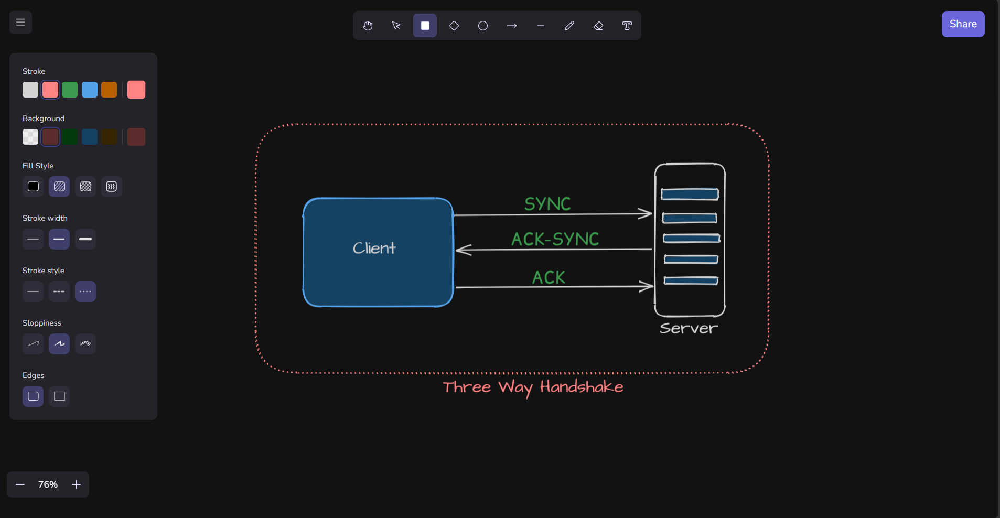

# Sketch

A real-time collaborative whiteboard application inspired by Excalidraw. Draw, sketch, and collaborate with others — no login required for solo use.

🔗 **Live Demo:** [sketch.ankitpwr.me](https://sketch.ankitpwr.me) &nbsp;|&nbsp; **Repo:** [github.com/ankitpwr/Sketch](https://github.com/ankitpwr/Sketch.git)



---

## Features

- **No login required** for solo/offline canvas usage
- **Real-time multi-user collaboration** — share a room and draw together live
- **Shape tools** — rectangles, diamonds, circles, arrows, and lines
- **Freehand pencil** with `perfect-freehand` for natural strokes
- **Rough/sketchy style** shapes powered by `Rough.js`
- **Eraser tool** — delete shapes individually
- **Move & resize** shapes with live sync across all collaborators
- **Grid background** for alignment
- **Zoom & pan** the canvas
- **Customizable styles** — stroke color, background color, fill style, stroke width, stroke style, sloppiness, and edge radius

---

## Tech Stack

| Layer            | Technology                       |
| ---------------- | -------------------------------- |
| Frontend         | Next.js, TypeScript, Canvas API  |
| Drawing          | Rough.js, perfect-freehand       |
| Backend          | Node.js, Express, TypeScript     |
| Real-time        | WebSocket (ws)                   |
| Auth             | JWT                              |
| Database         | Prisma ORM + NeonDB (PostgreSQL) |
| Monorepo         | Turborepo, pnpm workspaces       |
| Containerization | Docker, Docker Compose           |

---

## Project Structure

```
sketch/
├── apps/
│   ├── frontend/        # Next.js frontend
│   ├── http-server/     # REST API (auth, rooms, shapes)
│   └── ws-server/       # WebSocket server (real-time collaboration)
├── packages/
│   └── db/              # Prisma schema & client
├── docker/              # Dockerfiles for each service
├── docker-compose.yml
└── turbo.json
```

---

## Getting Started

### Prerequisites

- [Docker](https://docs.docker.com/get-docker/) & Docker Compose
- (Optional, for local dev) Node.js ≥ 18, pnpm

### Run with Docker (Recommended)

**1. Clone the repository**

```bash
git clone https://github.com/ankitpwr/Sketch.git
cd Sketch
```

**2. Set up environment variables**

Create the following `.env` files before running:

**`packages/db/.env`**

```dotenv
DATABASE_URL=your_neondb_connection_string
NODE_ENV=production
```

**`apps/ws-server/.env`**

```dotenv
JWT_SECRET=your_jwt_secret
PORT=8080
```

**`apps/http-server/.env`**

```dotenv
JWT_SECRET=your_jwt_secret
PORT=3001
EMAIL_HOST=smtp.example.com
EMAIL_PORT=587
EMAIL_USER=your_email@example.com
EMAIL_PASS=your_email_password
EMAIL_FROM=noreply@example.com
```

**`apps/frontend/.env`**

```dotenv
NEXT_PUBLIC_BASE_URL=http://localhost:3001
NEXT_PUBLIC_WS_BASE_URL=ws://localhost:8080
NEXT_PUBLIC_FE_URL=http://localhost:3000
```

**3. Start all services**

```bash
docker compose up --build
```

| Service   | URL                   |
| --------- | --------------------- |
| Frontend  | http://localhost:3000 |
| HTTP API  | http://localhost:3001 |
| WebSocket | ws://localhost:8080   |

---

### Run Locally (Without Docker)

**1. Install dependencies**

```bash
pnpm install
```

**2. Set up the database**

```bash
pnpm --filter @repo/db db:push
```

**3. Run all apps in parallel**

```bash
pnpm dev
```

---

## 🔌 API Overview

### Auth

| Method | Endpoint        | Description              |
| ------ | --------------- | ------------------------ |
| POST   | `/signup`       | Register a new user      |
| POST   | `/verify-email` | Verify OTP sent to email |
| POST   | `/signin`       | Login and receive JWT    |

### Rooms & Shapes

| Method | Endpoint         | Auth | Description                     |
| ------ | ---------------- | ---- | ------------------------------- |
| POST   | `/create-room`   | ✅   | Create a new collaboration room |
| GET    | `/room-messages` | ✅   | Fetch all shapes in a room      |
| POST   | `/user-data`     | ✅   | Get current user info           |

### WebSocket Events

Connect: `ws://host:8080?token=<jwt>`

| Type            | Direction        | Description                      |
| --------------- | ---------------- | -------------------------------- |
| `JOIN`          | Client → Server  | Join a room                      |
| `LEAVE`         | Client → Server  | Leave a room                     |
| `SHAPE`         | Client ↔ Server | Add a new shape                  |
| `PREVIEW_SHAPE` | Client ↔ Server | Live shape preview while drawing |
| `SHAPE_MOVE`    | Client ↔ Server | Move a shape                     |
| `SHAPE_RESIZE`  | Client ↔ Server | Resize a shape                   |
| `ERASER`        | Client ↔ Server | Delete shapes                    |

---

## Contributing

Contributions, issues, and feature requests are welcome! Feel free to open an issue or submit a pull request.

---
